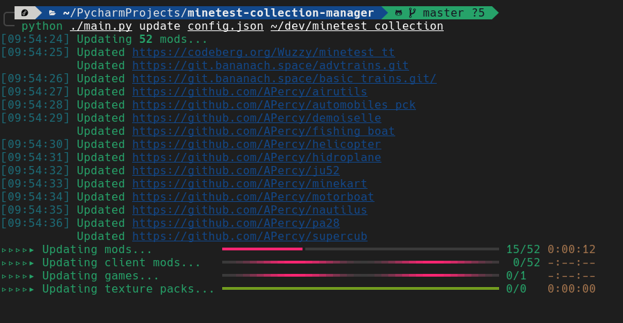

# Minetest Collection Manager



This project aims to help maintaining a collection of Minetest content (mods, games, etc) outside a Minetest user
directory. It allows sharing this collection with multiple Minetest installs.

You just need to provide a JSON config file containing which ContentDB and Git packages you want and an output folder
and it will clone and update everything. It will be also able to sync with a specific folder with your own development
stuff.

**It is done with the idea that all the mods _must_ be updated when possible. It is suitable for personnal collection if
you stay updated to latest Minetest versions, not for maintaining servers.**

## Installation

Make sure to have Python3 and PIP installed (tested with version 3.10 and above)

Go to the source code folder:

```shell
pip3 install -r requirements.txt
```

Then you can run the script:

```shell
python3 ./main.py --help
```

Usage exemples:

```shell
# Create a configuration file
# schema: the "$schema" JSON tag will be filled with the absolute path of the JSON schema (will not be updated if the script is moved around)
# auto-sort: the entries in the config file are automatically sorted alphabetically when modified from CLI
python3 ./main.py create-config ./config_file.json --schema --auto-sort

# Add a package to the config file
# The package is a mod and uses git
# This only modify the config file, mod isn't downloaded
# The availlable package categories are: "mods", "client_mods", "games", "texture_packs"
python3 ./main.py add-package ./config_file.json mods git https://notabug.org/tenplus1/bonemeal

# Add a package to the config file and sort the entries (useful when autosort disabled)
python3 ./main.py add-package ./config_file.json mods git https://github.com/AFCMS/Subway-Miner --sort

# Add a Git package to the config file and pull from specific branch
python3 ./main.py add-package ./config_file.json mods git https://github.com/AFCMS/Subway-Miner --git-remote-branch=other_branch

# Add a package from CDB (work with any up-to-date instances)
python3 ./main.py add-package ./config_file.json mods cdb https://content.minetest.net/packages/davidthecreator/rangedweapons

# Remove a package from the config file
python ./main.py remove-package ./config.json mods git https://notabug.org/tenplus1/bonemeal

# Update the collection folder with the config file
# Packages that are present will be updated (including submodules for Git repositories)
# Other packages will be cloned/downloaded
# If any package has been removed from the config file, it's folder WONT BE REMOVED and should be done by hand
python3 ./main.py update ./config_file.json ~/minetest_collection

# Sync a collection folder with a Minetest installation
# Will symlink folders from the collection folder to the Minetest installation
# Will report folders that cannot be symlinked without removing existing folder
python3 ./main.py sync ~/minetest_collection ~/.minetest

# Sync a development folder with a collection folder
# Will symlink folders from the development folder to the collection folder
# You will need to run the sync command to update your Minetest installs
python3 ./main.py sync-dev ~/minetest_collection ~/minetest_development
```